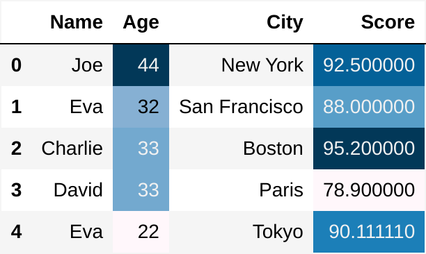

#+title: Tests
#+PROPERTY: header-args:python :results output drawer :python "../../.venv/bin/python3" :tangle yes

* Testing sessions:
:PROPERTIES:
:header-args: :results output drawer :session timer_formatting_tests
:END:

#+name: testing_sessions_set_variable
#+begin_src python
x = 1
#+end_src

#+RESULTS: testing_sessions_set_variable
:results:
Cell Timer: 0:00:00
:end:

#+name: testing_sessions_print
#+begin_src python
print(x*2)
#+end_src

#+RESULTS: testing_sessions_print
:results:
2
Cell Timer: 0:00:00
:end:

* Timer formatting
:PROPERTIES:
:header-args: :results output drawer :tangle :session timer_formatting_tests
:END:

Rounds by default, and shows by default:

#+name: timer
#+begin_src python
print(1)
import time
time.sleep(3)
#+end_src

#+RESULTS: timer
:results:
1
Cell Timer: 0:00:03
:end:

Turn off timer-show to hide it

#+name: turn_off_timer
#+begin_src python :timer-show no
print(1)
#+end_src

#+RESULTS: turn_off_timer
:results:
1
:end:

Set :timer-rounded to no to get the full timer.
(Also modifying the timer string here so that my expect tests will skip it.)

#+name: not_rounded_timer
#+begin_src python :timer-rounded no :timer-string expect_skip Cell Timer:
print(1)
#+end_src

#+RESULTS: not_rounded_timer
:results:
1
expect_skip Cell Timer: 0:00:00.000227
:end:

* Table formatting
:PROPERTIES:
:header-args: :results output drawer :tangle :session table_formatting :timer-show no
:END:

** As org tables
By default dataframes are printed as org tables

#+name: print_table
#+begin_src python :results drawer
import pandas as pd
data = {
'Name': ['Joe', 'Eva', 'Charlie', 'David', 'Eva'],
'Age': [44, 32, 33,33, 22],
'City': ['New York', 'San Francisco', 'Boston', 'Paris', 'Tokyo'],
'Score': [92.5, 88.0, 95.2, 78.9, 90.11111]}
df = pd.DataFrame(data)
print(df)
#+end_src

#+RESULTS: print_table
:results:
| idx | Name    | Age | City          |    Score | 
 |
|-----+---------+-----+---------------+----------+----|
|   0 | Joe     |  44 | New York      |     92.5 | 
 |
|   1 | Eva     |  32 | San Francisco |     88.0 | 
 |
|   2 | Charlie |  33 | Boston        |     95.2 | 
 |
|   3 | David   |  33 | Paris         |     78.9 | 
 |
|   4 | Eva     |  22 | Tokyo         | 90.11111 |    |
:end:

This respects various pandas options:
**** Float formatting

#+name: format_table_floats
#+begin_src python
pd.options.display.float_format = '{:.1f}'.format
print(df.set_index("Name"))
#+end_src

#+RESULTS: format_table_floats
:results:
| Name    | Age | City          | Score | 
 |
|---------+-----+---------------+-------+----|
| Joe     |  44 | New York      |  92.5 | 
 |
| Eva     |  32 | San Francisco |  88.0 | 
 |
| Charlie |  33 | Boston        |  95.2 | 
 |
| David   |  33 | Paris         |  78.9 | 
 |
| Eva     |  22 | Tokyo         |  90.1 |    |
:end:

**** Max rows

#+name: limit_table_max_rows
#+begin_src python
pd.options.display.max_rows = 10
long_df = pd.DataFrame({'A': range(200)})
print(long_df)
#+end_src

#+RESULTS: limit_table_max_rows
:results:
| idx | A | 
 |
|-----+---+----|
|   0 | 0 | 
 |
|   1 | 1 | 
 |
|   2 | 2 | 
 |
|   3 | 3 | 
 |
|   4 | 4 | 
 |
|   5 | 5 | 
 |
|   6 | 6 | 
 |
|   7 | 7 | 
 |
|   8 | 8 | 
 |
|   9 | 9 |    |
:end:

*** Problem -- hangs when printing large dataframes.
:PROPERTIES:
:header-args: :results output drawer :tangle :session table_formatting_large_dtfs :timer-show no
:END:

print_org_df sets max_rows to be 20 by default to avoid this issue.

#+name: print_long_table
#+begin_src python :tables-auto-align no
import pandas as pd
long_df = pd.DataFrame({'A': range(400)})
print(long_df)
#+end_src

#+RESULTS: print_long_table
:results:
| idx |  A | 
 |
|-----+----+----|
|   0 |  0 | 
 |
|   1 |  1 | 
 |
|   2 |  2 | 
 |
|   3 |  3 | 
 |
|   4 |  4 | 
 |
|   5 |  5 | 
 |
|   6 |  6 | 
 |
|   7 |  7 | 
 |
|   8 |  8 | 
 |
|   9 |  9 | 
 |
|  10 | 10 | 
 |
|  11 | 11 | 
 |
|  12 | 12 | 
 |
|  13 | 13 | 
 |
|  14 | 14 | 
 |
|  15 | 15 | 
 |
|  16 | 16 | 
 |
|  17 | 17 | 
 |
|  18 | 18 | 
 |
|  19 | 19 |    |
:end:

If we make the max_rows even modestly large, we run into it, depending on computing resources.

#+name: print_medium_table
#+begin_src python :tables-auto-align no
pd.options.display.max_rows = 200
long_df = pd.DataFrame({'A': range(200)})
print(long_df)
#+end_src

#+RESULTS: print_medium_table
:results:
| idx |   A | 
 |
|-----+-----+----|
|   0 |   0 | 
 |
|   1 |   1 | 
 |
|   2 |   2 | 
 |
|   3 |   3 | 
 |
|   4 |   4 | 
 |
|   5 |   5 | 
 |
|   6 |   6 | 
 |
|   7 |   7 | 
 |
|   8 |   8 | 
 |
|   9 |   9 | 
 |
|  10 |  10 | 
 |
|  11 |  11 | 
 |
|  12 |  12 | 
 |
|  13 |  13 | 
 |
|  14 |  14 | 
 |
|  15 |  15 | 
 |
|  16 |  16 | 
 |
|  17 |  17 | 
 |
|  18 |  18 | 
 |
|  19 |  19 | 
 |
|  20 |  20 | 
 |
|  21 |  21 | 
 |
|  22 |  22 | 
 |
|  23 |  23 | 
 |
|  24 |  24 | 
 |
|  25 |  25 | 
 |
|  26 |  26 | 
 |
|  27 |  27 | 
 |
|  28 |  28 | 
 |
|  29 |  29 | 
 |
|  30 |  30 | 
 |
|  31 |  31 | 
 |
|  32 |  32 | 
 |
|  33 |  33 | 
 |
|  34 |  34 | 
 |
|  35 |  35 | 
 |
|  36 |  36 | 
 |
|  37 |  37 | 
 |
|  38 |  38 | 
 |
|  39 |  39 | 
 |
|  40 |  40 | 
 |
|  41 |  41 | 
 |
|  42 |  42 | 
 |
|  43 |  43 | 
 |
|  44 |  44 | 
 |
|  45 |  45 | 
 |
|  46 |  46 | 
 |
|  47 |  47 | 
 |
|  48 |  48 | 
 |
|  49 |  49 | 
 |
|  50 |  50 | 
 |
|  51 |  51 | 
 |
|  52 |  52 | 
 |
|  53 |  53 | 
 |
|  54 |  54 | 
 |
|  55 |  55 | 
 |
|  56 |  56 | 
 |
|  57 |  57 | 
 |
|  58 |  58 | 
 |
|  59 |  59 | 
 |
|  60 |  60 | 
 |
|  61 |  61 | 
 |
|  62 |  62 | 
 |
|  63 |  63 | 
 |
|  64 |  64 | 
 |
|  65 |  65 | 
 |
|  66 |  66 | 
 |
|  67 |  67 | 
 |
|  68 |  68 | 
 |
|  69 |  69 | 
 |
|  70 |  70 | 
 |
|  71 |  71 | 
 |
|  72 |  72 | 
 |
|  73 |  73 | 
 |
|  74 |  74 | 
 |
|  75 |  75 | 
 |
|  76 |  76 | 
 |
|  77 |  77 | 
 |
|  78 |  78 | 
 |
|  79 |  79 | 
 |
|  80 |  80 | 
 |
|  81 |  81 | 
 |
|  82 |  82 | 
 |
|  83 |  83 | 
 |
|  84 |  84 | 
 |
|  85 |  85 | 
 |
|  86 |  86 | 
 |
|  87 |  87 | 
 |
|  88 |  88 | 
 |
|  89 |  89 | 
 |
|  90 |  90 | 
 |
|  91 |  91 | 
 |
|  92 |  92 | 
 |
|  93 |  93 | 
 |
|  94 |  94 | 
 |
|  95 |  95 | 
 |
|  96 |  96 | 
 |
|  97 |  97 | 
 |
|  98 |  98 | 
 |
|  99 |  99 | 
 |
| 100 | 100 | 
 |
| 101 | 101 | 
 |
| 102 | 102 | 
 |
| 103 | 103 | 
 |
| 104 | 104 | 
 |
| 105 | 105 | 
 |
| 106 | 106 | 
 |
| 107 | 107 | 
 |
| 108 | 108 | 
 |
| 109 | 109 | 
 |
| 110 | 110 | 
 |
| 111 | 111 | 
 |
| 112 | 112 | 
 |
| 113 | 113 | 
 |
| 114 | 114 | 
 |
| 115 | 115 | 
 |
| 116 | 116 | 
 |
| 117 | 117 | 
 |
| 118 | 118 | 
 |
| 119 | 119 | 
 |
| 120 | 120 | 
 |
| 121 | 121 | 
 |
| 122 | 122 | 
 |
| 123 | 123 | 
 |
| 124 | 124 | 
 |
| 125 | 125 | 
 |
| 126 | 126 | 
 |
| 127 | 127 | 
 |
| 128 | 128 | 
 |
| 129 | 129 | 
 |
| 130 | 130 | 
 |
| 131 | 131 | 
 |
| 132 | 132 | 
 |
| 133 | 133 | 
 |
| 134 | 134 | 
 |
| 135 | 135 | 
 |
| 136 | 136 | 
 |
| 137 | 137 | 
 |
| 138 | 138 | 
 |
| 139 | 139 | 
 |
| 140 | 140 | 
 |
| 141 | 141 | 
 |
| 142 | 142 | 
 |
| 143 | 143 | 
 |
| 144 | 144 | 
 |
| 145 | 145 | 
 |
| 146 | 146 | 
 |
| 147 | 147 | 
 |
| 148 | 148 | 
 |
| 149 | 149 | 
 |
| 150 | 150 | 
 |
| 151 | 151 | 
 |
| 152 | 152 | 
 |
| 153 | 153 | 
 |
| 154 | 154 | 
 |
| 155 | 155 | 
 |
| 156 | 156 | 
 |
| 157 | 157 | 
 |
| 158 | 158 | 
 |
| 159 | 159 | 
 |
| 160 | 160 | 
 |
| 161 | 161 | 
 |
| 162 | 162 | 
 |
| 163 | 163 | 
 |
| 164 | 164 | 
 |
| 165 | 165 | 
 |
| 166 | 166 | 
 |
| 167 | 167 | 
 |
| 168 | 168 | 
 |
| 169 | 169 | 
 |
| 170 | 170 | 
 |
| 171 | 171 | 
 |
| 172 | 172 | 
 |
| 173 | 173 | 
 |
| 174 | 174 | 
 |
| 175 | 175 | 
 |
| 176 | 176 | 
 |
| 177 | 177 | 
 |
| 178 | 178 | 
 |
| 179 | 179 | 
 |
| 180 | 180 | 
 |
| 181 | 181 | 
 |
| 182 | 182 | 
 |
| 183 | 183 | 
 |
| 184 | 184 | 
 |
| 185 | 185 | 
 |
| 186 | 186 | 
 |
| 187 | 187 | 
 |
| 188 | 188 | 
 |
| 189 | 189 | 
 |
| 190 | 190 | 
 |
| 191 | 191 | 
 |
| 192 | 192 | 
 |
| 193 | 193 | 
 |
| 194 | 194 | 
 |
| 195 | 195 | 
 |
| 196 | 196 | 
 |
| 197 | 197 | 
 |
| 198 | 198 | 
 |
| 199 | 199 |    |
:end:

*** Printing multiple dataframes:

#+name: printing_multiple_dataframes
#+begin_src python
print(df)
print("Space between dataframes")
print(df)
#+end_src

#+RESULTS: printing_multiple_dataframes
:results:
| idx | Name    | Age | City          | Score | 
 |
|-----+---------+-----+---------------+-------+----|
|   0 | Joe     |  44 | New York      |  92.5 | 
 |
|   1 | Eva     |  32 | San Francisco |  88.0 | 
 |
|   2 | Charlie |  33 | Boston        |  95.2 | 
 |
|   3 | David   |  33 | Paris         |  78.9 | 
 |
|   4 | Eva     |  22 | Tokyo         |  90.1 | 
 |
Space between dataframes
| idx | Name    | Age | City          | Score | 
 |
|-----+---------+-----+---------------+-------+----|
|   0 | Joe     |  44 | New York      |  92.5 | 
 |
|   1 | Eva     |  32 | San Francisco |  88.0 | 
 |
|   2 | Charlie |  33 | Boston        |  95.2 | 
 |
|   3 | David   |  33 | Paris         |  78.9 | 
 |
|   4 | Eva     |  22 | Tokyo         |  90.1 |    |
:end:

In general space between dataframes requires ones below to be aligned.
I have an advise function ( adjust-org-babel-results ) that does this, but it can be slow if there are many tables in the org file, so it can be disabled like this.

#+name: tables_auto_align_off
#+begin_src python :tables-auto-align no
print(df)
print("Space between dataframes")
print(df)
#+end_src

#+RESULTS: tables_auto_align_off
:results:
| idx | Name    | Age | City          | Score | 
 |
|-----+---------+-----+---------------+-------+----|
|   0 | Joe     |  44 | New York      |  92.5 | 
 |
|   1 | Eva     |  32 | San Francisco |  88.0 | 
 |
|   2 | Charlie |  33 | Boston        |  95.2 | 
 |
|   3 | David   |  33 | Paris         |  78.9 | 
 |
|   4 | Eva     |  22 | Tokyo         |  90.1 | 
 |
Space between dataframes
| idx  |Name|Age|City|Score |
|-----------------------------------|
| 0|Joe|44|New York|92.5 |
| 1|Eva|32|San Francisco|88.0 |
| 2|Charlie|33|Boston|95.2 |
| 3|David|33|Paris|78.9 |
| 4|Eva|22|Tokyo|90.1 |
:end:

*** Bug -- tables that contain | are buggy.
:PROPERTIES:
:header-args: :results output drawer :tangle :session test_bug :timer-show no
:END:

Need a way to handle |'s in the string names

#+begin_src python
import pandas as pd

df = pd.DataFrame({"names": ["John \vert", "Mary", "Bob  Rob", "Alice John", "Tom"]})
print(df)
#+end_src

#+RESULTS:
:results:
| idx | names  | 
 |
|-----+--------+----|
|   0 | John
 |    |
ert \
| 1 | Mary       | 
 |
| 2 | Bob  Rob   | 
 |
| 3 | Alice John | 
 |
| 4 | Tom        |    |
:end:

One work around is to call to_markdown directly, as ob-python-extras converts | that are not in dataframes into \ to prevent org from incorrectly recognizing text as tables.

#+begin_src python
import pandas as pd

df = pd.DataFrame({"names": ["John", "Mary", "Bob|Rob", "Alice|John", "Tom"]})
print(df.to_markdown())
#+end_src

#+RESULTS:
:results:
Traceback (most recent call last):
File "/Users/elle/code/ob-python-extras/.venv/lib/python3.13/site-packages/pandas/compat/_optional.py", line 158, in import_optional_dependency
module = importlib.import_module(name)
File "/Users/elle/.local/share/uv/python/cpython-3.13.2-macos-aarch64-none/lib/python3.13/importlib/__init__.py", line 88, in import_module
return _bootstrap._gcd_import(name[level:], package, level)
~~~~~~~~~~~~~~~~~~~~~~^^^^^^^^^^^^^^^^^^^^^^^^^^^^^^
File "<frozen importlib._bootstrap>", line 1387, in _gcd_import
File "<frozen importlib._bootstrap>", line 1360, in _find_and_load
File "<frozen importlib._bootstrap>", line 1324, in _find_and_load_unlocked
ModuleNotFoundError: No module named 'tabulate'
The above exception was the direct cause of the following exception:
Traceback (most recent call last):
File "<babel-formatting: org babel source block> ", line 38, in <module>
File "<org babel source block>", line 4, in <module>
File "/Users/elle/code/ob-python-extras/.venv/lib/python3.13/site-packages/pandas/core/frame.py", line 2983, in to_markdown
tabulate = import_optional_dependency("tabulate")
File "/Users/elle/code/ob-python-extras/.venv/lib/python3.13/site-packages/pandas/compat/_optional.py", line 161, in import_optional_dependency
raise ImportError(msg) from err
ImportError: `Import tabulate` failed.  Use pip or conda to install the tabulate package.
:end:

** Displaying styled dataframes as pngs

Dataframes can also be displayed as styled dataframes. This is nice for exporting documents with pretty tables.

Removing because I haven't been able to get it to work in CI.
--- #+name: styled_dataframes
#+begin_src python :dataframe_image yes :async t :dpi 200
styled_df = df.style.background_gradient()
print(styled_df)
#+end_src

#+RESULTS:
:results:
dd53c34f-ff6e-4ae5-8ea6-bdd853f00dc0
:end:

#+RESULTS: styled_dataframes
:results:

:end:

** Polars
:PROPERTIES:
:header-args: :results output drawer :tangle :session polars :show-timer no
:END:

Polars dataframes are always printed as an org table as well.

#+name: polars
#+begin_src python
import polars as pl

df = pl.DataFrame({"x": [1, 1, 3], "y": [2, 3, 1]})
print(df)
#+end_src

#+RESULTS: polars
:results:
(3, 2)
| idx | x | y | 
 |
|-----+---+---+----|
|   0 | 1 | 2 | 
 |
|   1 | 1 | 3 | 
 |
|   2 | 3 | 1 | 
 |
Cell Timer: 0:00:00
:end:

* Testing Tabulate
:PROPERTIES:
:header-args: :results output drawer :tangle :session test_tabulate :timer-show no
:END:

If Tabulate is available we can use it directly to formate the dataframe. This is built into pandas and the safer option.

#+name print_with_tabulate
#+begin_src python :results drawer
import pandas as pd
data = {
'Name': ['Joe', 'Eva', 'Charlie', 'David', 'Eva'],
'Age': [44, 32, 33,33, 22],
'City': ['New York', 'San Francisco', 'Boston', 'Paris', 'Tokyo'],
'Score': [92.5, 88.0, 95.2, 78.9, 90.11111]}
df = pd.DataFrame(data)
print(df)
#+end_src

#+RESULTS:
:results:
| idx | Name    | Age | City          |    Score | 
 |
|-----+---------+-----+---------------+----------+----|
|   0 | Joe     |  44 | New York      |     92.5 | 
 |
|   1 | Eva     |  32 | San Francisco |     88.0 | 
 |
|   2 | Charlie |  33 | Boston        |     95.2 | 
 |
|   3 | David   |  33 | Paris         |     78.9 | 
 |
|   4 | Eva     |  22 | Tokyo         | 90.11111 |    |
:end:

* Images
:PROPERTIES:
:header-args: :results output drawer :tangle :session project_images :timer-show no
:END:

mocks out python plotting to allow plots to be interspersed with printing, and allows multiple to be made. :)

#+name: table_with_plot_and_text
#+begin_src python :results drawer
import matplotlib.pyplot as plt
import pandas as pd

print("look!")
df = pd.DataFrame(
    {
        "x": [0, 2, 3, 4, 5, 6, 7],
        "y": [10, 11, 12, 13, 14, 15, 16],
    }
)
print(df)
df.plot(x="x", y="y", kind="line")
plt.show()
print("tada!")
#+end_src

#+RESULTS: table_with_plot_and_text
:results:
look!
| idx | x |  y | 
 |
|-----+---+----+----|
|   0 | 0 | 10 | 
 |
|   1 | 2 | 11 | 
 |
|   2 | 3 | 12 | 
 |
|   3 | 4 | 13 | 
 |
|   4 | 5 | 14 | 
 |
|   5 | 6 | 15 | 
 |
|   6 | 7 | 16 | 
 |
[[file:plots/babel-formatting/plot_20260202_175605_1346249.png]]
tada!
:end:

* HTML formatting
:PROPERTIES:
:header-args: :results output drawer :tangle :session HTML_formatting :timer-show no
:END:

#+name: converting_html_with_images_and_table
#+begin_src python :results output
import base64
from io import BytesIO

import matplotlib.pyplot as plt
import numpy as np
import pandas as pd

# Create sample data
df = pd.DataFrame(
    {
        "x": np.linspace(0, 10, 100),
        "sin": np.sin(np.linspace(0, 10, 100)),
        "cos": np.cos(np.linspace(0, 10, 100)),
    }
)

# Create matplotlib plot
plt.figure(figsize=(8, 4))
plt.plot(df["x"][:20], df["sin"][:20], label="sin")
plt.plot(df["x"][:20], df["cos"][:20], label="cos")
plt.legend()
plt.title("Sine and Cosine Waves")

# Convert plot to base64
buf = BytesIO()
plt.savefig(buf, format="png")
plt.close()
img_base64 = base64.b64encode(buf.getvalue()).decode("utf-8")

# Create HTML with table and image
html = f"""
<h1>Data Analysis Results</h1>

Here's a sample of our trigonometric functions:

{df.head().to_html(classes='dataframe')}

<b>Visualization:</b>

<i>Figure 1: First few periods of sine and cosine waves</i>

"""

print(html)
#+end_src

#+RESULTS: converting_html_with_images_and_table
:results:
- Data Analysis Results
Here's a sample of our trigonometric functions:

|   |       x |      sin |      cos | 
 |
|---+---------+----------+----------+----|
| 0 | 0.00000 | 0.000000 | 1.000000 | 
 |
| 1 | 0.10101 | 0.100838 | 0.994903 | 
 |
| 2 | 0.20202 | 0.200649 | 0.979663 | 
 |
| 3 | 0.30303 | 0.298414 | 0.954437 | 
 |
| 4 | 0.40404 | 0.393137 | 0.919480 | 
 |

*Visualization:*

[[file:plots/babel-formatting/aa998cf338aab4a386851d0dff713417f9d85a3a.png]]

/Figure 1: First few periods of sine and cosine waves/
:end:
** TODO Also use dataframe_image to get styled dataframes from the html output as pngs.
SCHEDULED: <2025-03-09 Sun>
* Error handling
:PROPERTIES:
:header-args: :results output drawer :tangle :session errors :timer-show no
:END:

#+begin_src python :errors "rich"
print(1 / 0)
#+end_src

#+RESULTS:
:results:
╭───────────────────── Traceback (most recent call last) ──────────────────────╮
│ in <module>:38                                                               │
│ ╭───────────────────────────────── locals ─────────────────────────────────╮ │
│ │          ast = <module 'ast' from                                        │ │
│ │                '/Users/elle/.local/share/uv/python/cpython-3.13.2-macos… │ │
│ │         attr = [                                                         │ │
│ │                │   11010,                                                │ │
│ │                │   3,                                                    │ │
│ │                │   19200,                                                │ │
│ │                │   1475,                                                 │ │
│ │                │   9600,                                                 │ │
│ │                │   9600,                                                 │ │
│ │                │   [                                                     │ │
│ │                │   │   b'\x04',                                          │ │
│ │                │   │   b'\xff',                                          │ │
│ │                │   │   b'\xff',                                          │ │
│ │                │   │   b'\x7f',                                          │ │
│ │                │   │   b'\x17',                                          │ │
│ │                │   │   b'\x15',                                          │ │
│ │                │   │   b'\x12',                                          │ │
│ │                │   │   b'\xff',                                          │ │
│ │                │   │   b'\x03',                                          │ │
│ │                │   │   b'\x1c',                                          │ │
│ │                │   │   ... +10                                           │ │
│ │                │   ]                                                     │ │
│ │                ]                                                         │ │
│ │            f = <_io.TextIOWrapper                                        │ │
│ │                name='/var/folders/wm/q6gwq3q56yj8rdyj_h_qhkd40000gn/T/p… │ │
│ │                mode='r' encoding='UTF-8'>                                │ │
│ │           os = <module 'os' (frozen)>                                    │ │
│ │           re = <module 're' from                                         │ │
│ │                '/Users/elle/.local/share/uv/python/cpython-3.13.2-macos… │ │
│ │     readline = <module 'readline' (built-in)>                            │ │
│ │ rich_console = <console width=80 None>                                   │ │
│ │   subprocess = <module 'subprocess' from                                 │ │
│ │                '/Users/elle/.local/share/uv/python/cpython-3.13.2-macos… │ │
│ │          sys = <module 'sys' (built-in)>                                 │ │
│ │      termios = <module 'termios' (built-in)>                             │ │
│ │         time = <module 'time' (built-in)>                                │ │
│ ╰──────────────────────────────────────────────────────────────────────────╯ │
│ in <module>:1                                                                │
│ ╭───────────────────────────────── locals ─────────────────────────────────╮ │
│ │          ast = <module 'ast' from                                        │ │
│ │                '/Users/elle/.local/share/uv/python/cpython-3.13.2-macos… │ │
│ │         attr = [                                                         │ │
│ │                │   11010,                                                │ │
│ │                │   3,                                                    │ │
│ │                │   19200,                                                │ │
│ │                │   1475,                                                 │ │
│ │                │   9600,                                                 │ │
│ │                │   9600,                                                 │ │
│ │                │   [                                                     │ │
│ │                │   │   b'\x04',                                          │ │
│ │                │   │   b'\xff',                                          │ │
│ │                │   │   b'\xff',                                          │ │
│ │                │   │   b'\x7f',                                          │ │
│ │                │   │   b'\x17',                                          │ │
│ │                │   │   b'\x15',                                          │ │
│ │                │   │   b'\x12',                                          │ │
│ │                │   │   b'\xff',                                          │ │
│ │                │   │   b'\x03',                                          │ │
│ │                │   │   b'\x1c',                                          │ │
│ │                │   │   ... +10                                           │ │
│ │                │   ]                                                     │ │
│ │                ]                                                         │ │
│ │            f = <_io.TextIOWrapper                                        │ │
│ │                name='/var/folders/wm/q6gwq3q56yj8rdyj_h_qhkd40000gn/T/p… │ │
│ │                mode='r' encoding='UTF-8'>                                │ │
│ │           os = <module 'os' (frozen)>                                    │ │
│ │           re = <module 're' from                                         │ │
│ │                '/Users/elle/.local/share/uv/python/cpython-3.13.2-macos… │ │
│ │     readline = <module 'readline' (built-in)>                            │ │
│ │ rich_console = <console width=80 None>                                   │ │
│ │   subprocess = <module 'subprocess' from                                 │ │
│ │                '/Users/elle/.local/share/uv/python/cpython-3.13.2-macos… │ │
│ │          sys = <module 'sys' (built-in)>                                 │ │
│ │      termios = <module 'termios' (built-in)>                             │ │
│ │         time = <module 'time' (built-in)>                                │ │
│ ╰──────────────────────────────────────────────────────────────────────────╯ │
╰──────────────────────────────────────────────────────────────────────────────╯
ZeroDivisionError: division by zero
:end:

#+begin_src python :errors "rich no-locals"
x = 0
print(1 / 0)
#+end_src

#+RESULTS:
:results:
╭───────────────────── Traceback (most recent call last) ──────────────────────╮
│ in <module>:38                                                               │
│ in <module>:2                                                                │
╰──────────────────────────────────────────────────────────────────────────────╯
ZeroDivisionError: division by zero
:end:

** TODO Get more detailed errors

* Last line print
:PROPERTIES:
:header-args: :results output drawer :session last_line_print :timer-show no :tangle yes
:END:

#+name testing_last_line_print
#+begin_src python
x = 1
print(x)
1000 * 2 + x
#+end_src

#+RESULTS:
:results:
1
:end:

** Edge case handling
Last line might not be an expression. Ideally this would get the last expression, but I'm settling for just not crashing.

(Achieved by checking if the code without the last line is valid python before execing it first; otherwise exec's the whole block. I don't like relying on _.)
#+name testing_last_line_print_not_full_expr
#+begin_src python
(
    1,
    2,
    3,
    4,
    1,
)
#+end_src

#+RESULTS:
:results:
:end:

Need to make sure that we handle comments on the last line
-- in general, print(last_line) is checked to be valid python syntax.

#+name last_line_a_comment
#+begin_src python
print(1)
# a comment
#+end_src

#+RESULTS:
:results:
1
:end:

* Torch
:PROPERTIES:
:header-args: :results output drawer :tangle :session torch :timer-show no
:END:

  #+begin_src python
import torch
x = torch.randn(3, 3)
print(x)
  #+end_src

  #+RESULTS:
  :results:
  tensor([[ 1.7013,  0.2442, -0.3779],
  │   │   [-1.3147, -1.0700,  0.3803],
  │   │   [ 0.6049, -1.1055, -1.6069]])
  :end:

  
  #+begin_src python
import torch

# Test tensor
x = torch.randn(3, 3)
print("Tensor:", x)
# Test dict
d = {"name": "Alice", "age": 30, "city": "New York", "hobbies": ["reading", "coding"]}
print("Dict:", d)

# Test list
l = [1, 2, 3, [4, 5, 6], {"nested": "dict"}]
print("List:", l)

# Test set
s = {1, 2, 3, 4, 5}
print("Set:", s)
import os
os.path
print(100)
  #+end_src

  #+RESULTS:
  :results:
  Tensor:
  tensor([[-0.6013, -0.8538, -0.7658],
  │   │   [ 0.7884,  1.4782, -2.2606],
  │   │   [ 0.4915,  0.3718, -0.6818]])
  Dict:
  {'name': 'Alice', 'age': 30, 'city': 'New York', 'hobbies': ['reading', 'coding']}
  List:
  [1, 2, 3, [4, 5, 6], {'nested': 'dict'}]
  Set:
  {1, 2, 3, 4, 5}
  100
  :end:

  
