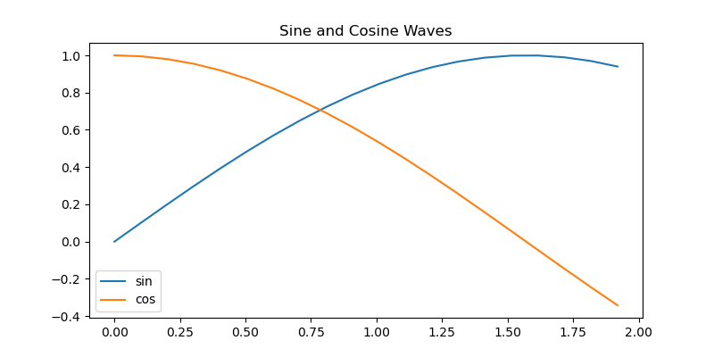

#+title: Tests

* Testing sessions:
:PROPERTIES:
:header-args: :results output drawer :tangle :session timer_formatting_tests
:END:

#+name: testing_sessions_set_variable
#+begin_src python
x = 1
#+end_src

#+name: testing_sessions_print
#+begin_src python
print(x*2)
#+end_src

* Timer formatting
:PROPERTIES:
:header-args: :results output drawer :python "nix-shell --run python"  :tangle :session timer_formatting_tests
:END:

Rounds by default, and shows by default:

#+name: timer
#+begin_src python
print(1)
import time
time.sleep(3)
#+end_src

Turn off timer-show to hide it

#+name: turn_off_timer
#+begin_src python :timer-show no
print(1)
#+end_src

Set :timer-rounded to no to get the full timer.
(Also modifying the timer string here so that my expect tests will skip it.)

#+name: not_rounded_timer
#+begin_src python :timer-rounded no :timer-string expect_skip Cell Timer:
print(1)
#+end_src

* Table formatting
:PROPERTIES:
:header-args: :results output drawer :python "nix-shell --run python"  :tangle :session table_formatting :timer-show no
:END:

** As org tables
By default dataframes are printed as org tables

#+name: print_table
#+begin_src python :results drawer
import pandas as pd
data = {
'Name': ['Joe', 'Eva', 'Charlie', 'David', 'Eva'],
'Age': [44, 32, 33,33, 22],
'City': ['New York', 'San Francisco', 'Boston', 'Paris', 'Tokyo'],
'Score': [92.5, 88.0, 95.2, 78.9, 90.11111]}
df = pd.DataFrame(data)
print(df)
#+end_src

#+RESULTS: print_table
:results:
| idx | Name    | Age | City          |    Score |
|-----+---------+-----+---------------+----------|
|   0 | Joe     |  44 | New York      |     92.5 |
|   1 | Eva     |  32 | San Francisco |     88.0 |
|   2 | Charlie |  33 | Boston        |     95.2 |
|   3 | David   |  33 | Paris         |     78.9 |
|   4 | Eva     |  22 | Tokyo         | 90.11111 |
:end:

This respects various pandas options:
**** Float formatting

#+name: format_table_floats
#+begin_src python
pd.options.display.float_format = '{:.1f}'.format
print(df.set_index("Name"))
#+end_src

**** Max rows

#+name: limit_table_max_rows
#+begin_src python
pd.options.display.max_rows = 10
long_df = pd.DataFrame({'A': range(200)})
print(long_df)
#+end_src

*** Problem -- hangs when printing large dataframes.
:PROPERTIES:
:header-args: :results output drawer :python "nix-shell --run python"  :tangle :session table_formatting_large_dtfs :timer-show no
:END:

print_org_df sets max_rows to be 20 by default to avoid this issue.

#+name: print_long_table
#+begin_src python :tables-auto-align no
import pandas as pd
long_df = pd.DataFrame({'A': range(400)})
print(long_df)
#+end_src

If we make the max_rows even modestly large, we run into it, depending on computing resources.

#+name: print_medium_table
#+begin_src python :tables-auto-align no
pd.options.display.max_rows = 200
long_df = pd.DataFrame({'A': range(200)})
print(long_df)
#+end_src

*** Printing multiple dataframes:

#+name: printing_multiple_dataframes
#+begin_src python
print(df)
print("Space between dataframes")
print(df)
#+end_src

In general space between dataframes requires ones below to be aligned.
I have an advise function ( adjust-org-babel-results ) that does this, but it can be slow if there are many tables in the org file, so it can be disabled like this.

#+name: tables_auto_align_off
#+begin_src python :tables-auto-align no
print(df)
print("Space between dataframes")
print(df)
#+end_src

*** Bug -- tables that contain | are buggy.
:PROPERTIES:
:header-args: :results output drawer :python "nix-shell shell_with_tabulate.nix --run python"  :tangle :session test_bug :timer-show no
:END:

Need a way to handle |'s in the string names

#+begin_src python
import pandas as pd

df = pd.DataFrame({"names": ["John \vert", "Mary", "Bob  Rob", "Alice John", "Tom"]})
print(df)
#+end_src

#+RESULTS:
:results:
|   | names |
|---+-------|
| 0 | John  |
ert            \
| 1 | Mary       |
| 2 | Bob  Rob   |
| 3 | Alice John |
| 4 | Tom        |
:end:

One work around is to call to_markdown directly, as ob-python-extras converts | that are not in dataframes into \ to prevent org from incorrectly recognizing text as tables.

#+begin_src python
import pandas as pd

df = pd.DataFrame({"names": ["John", "Mary", "Bob|Rob", "Alice|John", "Tom"]})
print(df.to_markdown())
#+end_src

#+RESULTS:
:results:
\    \ names      \
\---:\:-----------\
\  0 \ John       \
\  1 \ Mary       \
\  2 \ Bob\Rob    \
\  3 \ Alice\John \
\  4 \ Tom        \
:end:

** Displaying styled dataframes as pngs

Dataframes can also be displayed as styled dataframes. This is nice for exporting documents with pretty tables.

Removing because I haven't been able to get it to work in CI.
--- #+name: styled_dataframes
#+begin_src python :dataframe_image yes :async t :dpi 200
styled_df = df.style.background_gradient()
print(styled_df)
#+end_src

#+RESULTS: styled_dataframes
:results:
[[file:plots/babel-formatting/df_plot_20250309_233812_9163414.png]]
:end:

** Polars
:PROPERTIES:
:header-args: :results output drawer :python "nix-shell --run python"  :tangle :session polars :show-timer no
:END:

Polars dataframes are always printed as an org table as well.

#+name: polars
#+begin_src python
import polars as pl

df = pl.DataFrame({"x": [1, 1, 3], "y": [2, 3, 1]})
print(df)
#+end_src

#+RESULTS: polars
:results:
(3, 2)
| idx | x | y |
|-----+---+---|
|   0 | 1 | 2 |
|   1 | 1 | 3 |
|   2 | 3 | 1 |
Cell Timer: 0:00:00
:end:

* Testing Tabulate
:PROPERTIES:
:header-args: :results output drawer :python "nix-shell shell_with_tabulate.nix --run python"  :tangle :session test_tabulate :timer-show no
:END:

If Tabulate is available we can use it directly to formate the dataframe. This is built into pandas and the safer option.

#+name print_with_tabulate
#+begin_src python :results drawer
import pandas as pd
data = {
'Name': ['Joe', 'Eva', 'Charlie', 'David', 'Eva'],
'Age': [44, 32, 33,33, 22],
'City': ['New York', 'San Francisco', 'Boston', 'Paris', 'Tokyo'],
'Score': [92.5, 88.0, 95.2, 78.9, 90.11111]}
df = pd.DataFrame(data)
print(df)
#+end_src
* Images
:PROPERTIES:
:header-args: :results output drawer :python "nix-shell --run python"  :tangle :session project_images :timer-show no
:END:

mocks out python plotting to allow plots to be interspersed with printing, and allows multiple to be made. :)

#+name: table_with_plot_and_text
#+begin_src python :results drawer
import matplotlib.pyplot as plt
import pandas as pd

print("look!")
df = pd.DataFrame(
    {
        "x": [0, 2, 3, 4, 5, 6, 7],
        "y": [10, 11, 12, 13, 14, 15, 16],
    }
)
print(df)
df.plot(x="x", y="y", kind="line")
plt.show()
print("tada!")
#+end_src

* Alerts on finishing
:PROPERTIES:
:header-args: :results output drawer :python "nix-shell --run python"  :tangle :session alerts_on_finish :timer-show no
:END:

When this finishes, it alerts you in an emacs minibuffer, with a link back.
You also get a system alert. (This requires libnotify to be installed.)

#+begin_src python :alert yes
import time
print("waiting")
time.sleep(1)
print("finished")
#+end_src

#+begin_src python
import time
print("waiting")
time.sleep(1)
print("finished")
#+end_src

I also have it configured to send an alert for any cell that takes more than 10 seconds.

* HTML formatting
:PROPERTIES:
:header-args: :results output drawer :python "nix-shell --run python"  :tangle :session HTML_formatting :timer-show no
:END:

#+name: converting_html_with_images_and_table
#+begin_src python :results output
import base64
from io import BytesIO

import matplotlib.pyplot as plt
import numpy as np
import pandas as pd

# Create sample data
df = pd.DataFrame(
    {
        "x": np.linspace(0, 10, 100),
        "sin": np.sin(np.linspace(0, 10, 100)),
        "cos": np.cos(np.linspace(0, 10, 100)),
    }
)

# Create matplotlib plot
plt.figure(figsize=(8, 4))
plt.plot(df["x"][:20], df["sin"][:20], label="sin")
plt.plot(df["x"][:20], df["cos"][:20], label="cos")
plt.legend()
plt.title("Sine and Cosine Waves")

# Convert plot to base64
buf = BytesIO()
plt.savefig(buf, format="png")
plt.close()
img_base64 = base64.b64encode(buf.getvalue()).decode("utf-8")

# Create HTML with table and image
html = f"""
<h1>Data Analysis Results</h1>

Here's a sample of our trigonometric functions:

{df.head().to_html(classes='dataframe')}

<b>Visualization:</b>

<i>Figure 1: First few periods of sine and cosine waves</i>

"""

print(html)
#+end_src

#+RESULTS: converting_html_with_images_and_table
:results:
- Data Analysis Results
Here's a sample of our trigonometric functions:

|   |       x |      sin |      cos |
|---+---------+----------+----------|
| 0 | 0.00000 | 0.000000 | 1.000000 |
| 1 | 0.10101 | 0.100838 | 0.994903 |
| 2 | 0.20202 | 0.200649 | 0.979663 |
| 3 | 0.30303 | 0.298414 | 0.954437 |
| 4 | 0.40404 | 0.393137 | 0.919480 |

*Visualization:*

/Figure 1: First few periods of sine and cosine waves/
:end:
** TODO Also use dataframe_image to get styled dataframes from the html output as pngs.
SCHEDULED: <2025-03-09 Sun>
* Error handling
:PROPERTIES:
:header-args: :results output drawer :python "nix-shell --run python"  :tangle :session errors :timer-show no
:END:

#+begin_src python :errors "rich"
print(1 / 0)
#+end_src

#+RESULTS:
:results:
╭───────────────────── Traceback (most recent call last) ──────────────────────╮
│ in <module>:28                                                               │
│ ╭───────────────────────────────── locals ─────────────────────────────────╮ │
│ │          ast = <module 'ast' from                                        │ │
│ │                '/nix/store/bm0zc89iq0aml2afkqq5j7sy0ax7cwp6-python3-3.1… │ │
│ │            f = <_io.TextIOWrapper name='/tmp/babel-pnB2aZ/python-G3FRkP' │ │
│ │                mode='r' encoding='UTF-8'>                                │ │
│ │           os = <module 'os' (frozen)>                                    │ │
│ │           re = <module 're' from                                         │ │
│ │                '/nix/store/bm0zc89iq0aml2afkqq5j7sy0ax7cwp6-python3-3.1… │ │
│ │     readline = <module 'readline' from                                   │ │
│ │                '/nix/store/bm0zc89iq0aml2afkqq5j7sy0ax7cwp6-python3-3.1… │ │
│ │ rich_console = <console width=80 None>                                   │ │
│ │   subprocess = <module 'subprocess' from                                 │ │
│ │                '/nix/store/bm0zc89iq0aml2afkqq5j7sy0ax7cwp6-python3-3.1… │ │
│ │          sys = <module 'sys' (built-in)>                                 │ │
│ │         time = <module 'time' (built-in)>                                │ │
│ │          tty = <module 'tty' from                                        │ │
│ │                '/nix/store/bm0zc89iq0aml2afkqq5j7sy0ax7cwp6-python3-3.1… │ │
│ ╰──────────────────────────────────────────────────────────────────────────╯ │
│ in <module>:1                                                                │
│ ╭───────────────────────────────── locals ─────────────────────────────────╮ │
│ │          ast = <module 'ast' from                                        │ │
│ │                '/nix/store/bm0zc89iq0aml2afkqq5j7sy0ax7cwp6-python3-3.1… │ │
│ │            f = <_io.TextIOWrapper name='/tmp/babel-pnB2aZ/python-G3FRkP' │ │
│ │                mode='r' encoding='UTF-8'>                                │ │
│ │           os = <module 'os' (frozen)>                                    │ │
│ │           re = <module 're' from                                         │ │
│ │                '/nix/store/bm0zc89iq0aml2afkqq5j7sy0ax7cwp6-python3-3.1… │ │
│ │     readline = <module 'readline' from                                   │ │
│ │                '/nix/store/bm0zc89iq0aml2afkqq5j7sy0ax7cwp6-python3-3.1… │ │
│ │ rich_console = <console width=80 None>                                   │ │
│ │   subprocess = <module 'subprocess' from                                 │ │
│ │                '/nix/store/bm0zc89iq0aml2afkqq5j7sy0ax7cwp6-python3-3.1… │ │
│ │          sys = <module 'sys' (built-in)>                                 │ │
│ │         time = <module 'time' (built-in)>                                │ │
│ │          tty = <module 'tty' from                                        │ │
│ │                '/nix/store/bm0zc89iq0aml2afkqq5j7sy0ax7cwp6-python3-3.1… │ │
│ ╰──────────────────────────────────────────────────────────────────────────╯ │
╰──────────────────────────────────────────────────────────────────────────────╯
ZeroDivisionError: division by zero
:end:

#+begin_src python :errors "rich no-locals"
x = 0
print(1 / 0)
#+end_src

#+RESULTS:
:results:
╭───────────────────── Traceback (most recent call last) ──────────────────────╮
│ in <module>:28                                                               │
│ in <module>:1                                                                │
╰──────────────────────────────────────────────────────────────────────────────╯
ZeroDivisionError: division by zero
:end:

** TODO Get more detailed errors

* Last line print
:PROPERTIES:
:header-args: :results output drawer :python "nix-shell shell_with_tabulate.nix --run python" :session last_line_print :timer-show no :tangle yes
:END:

#+name testing_last_line_print
#+begin_src python
x = 1
print(x)
1000 * 2 + x
#+end_src

#+RESULTS:
:results:
1
2001
:end:

** Edge case handling
Last line might not be an expression. Ideally this would get the last expression, but I'm settling for just not crashing.

(Achieved by checking if the code without the last line is valid python before execing it first; otherwise exec's the whole block. I don't like relying on _.)
#+name testing_last_line_print_not_full_expr
#+begin_src python
(
    1,
    2,
    3,
    4,
    1,
)
#+end_src

#+RESULTS:
:results:
:end:

Need to make sure that we handle comments on the last line
-- in general, print(last_line) is checked to be valid python syntax.

#+name last_line_a_comment
#+begin_src python
print(1)
# a comment
#+end_src

#+RESULTS:
:results:
1
:end:

